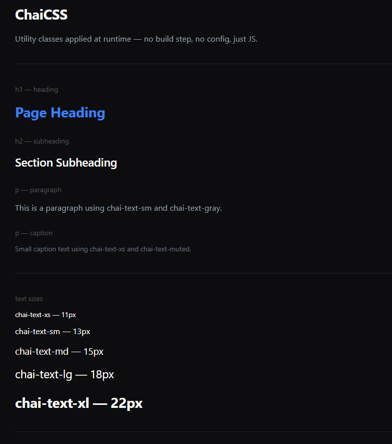
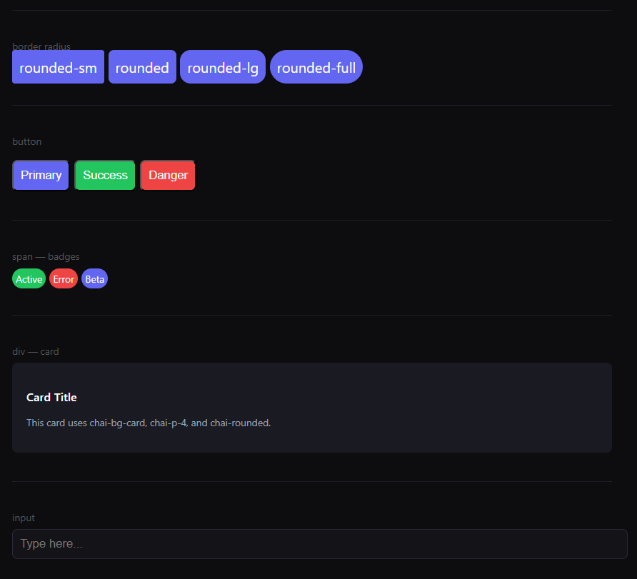

# ☕ chai-tailwindUI

> Build UIs with utility classes — no install, no build step, just HTML + JS.

**chai-tailwindUI** is a lightweight, zero-dependency utility-class system built from scratch using vanilla JavaScript. Inspired by Tailwind CSS, it works by scanning your HTML for `chai-*` class names and applying the corresponding styles at runtime — no npm, no bundler, no config file needed.

---

## Demo





---

## 📁 Project Structure

```
chai-tailwindUI/
├── index.html   # Demo file showing all available utility classes
└── script.js    # css logic using js
```

---

## ⚙️ Setup

```bash
git clone https://github.com/SaurabhRavte/chai-tailwindUI.git
cd chai-tailwindUI
```

Then just open `index.html` in your browser.

---

## 🧑‍💻 How to Use

### Step 1 — Add the `chai` base class

Every element you want to style must have the `chai` class. This tells the JS engine to process it.

```html
<h1 class="chai chai-text-xl chai-font-bold chai-text-blue">Hello World</h1>
```

### Step 2 — Add utility classes

Stack as many `chai-*` classes as you need:

```html
<button
  class="chai chai-bg-indigo chai-text-white chai-p-2 chai-rounded chai-pointer"
>
  Click Me
</button>
```

### Step 3 — Open in browser

Just open your HTML file directly in the browser using live server extension.

---

## 🎨 Available Utility Classes

### Typography

| Class            | What it does           |
| ---------------- | ---------------------- |
| `chai-text-xs`   | Extra small font size  |
| `chai-text-sm`   | Small font size        |
| `chai-text-base` | Base/default font size |
| `chai-text-lg`   | Large font size        |
| `chai-text-xl`   | Extra large font size  |
| `chai-font-bold` | Bold font weight       |

### Colors — Text

| Class             | What it does |
| ----------------- | ------------ |
| `chai-text-blue`  | Blue text    |
| `chai-text-gray`  | Gray text    |
| `chai-text-white` | White text   |
| `chai-text-green` | Green text   |

### Colors — Background

| Class             | What it does                  |
| ----------------- | ----------------------------- |
| `chai-bg-indigo`  | Indigo background             |
| `chai-bg-green`   | Green background              |
| `chai-bg-red`     | Red background                |
| `chai-bg-card`    | Dark card background          |
| `chai-bg-surface` | Slightly lighter dark surface |

### Spacing

| Class      | What it does  |
| ---------- | ------------- |
| `chai-p-2` | Padding: 8px  |
| `chai-p-3` | Padding: 12px |
| `chai-p-4` | Padding: 16px |

### Border Radius

| Class               | What it does               |
| ------------------- | -------------------------- |
| `chai-rounded`      | Slightly rounded corners   |
| `chai-rounded-full` | Fully rounded (pill shape) |

### Layout

| Class         | What it does     |
| ------------- | ---------------- |
| `chai-block`  | `display: block` |
| `chai-w-full` | `width: 100%`    |

### Cusrsor

| Class          | What it does      |
| -------------- | ----------------- |
| `chai-pointer` | `cursor: pointer` |

---

## 💡 Examples

### Heading

```html
<h1 class="chai chai-text-xl chai-font-bold chai-text-blue">Chai TailwindUI</h1>
```

### Card

```html
<div class="chai chai-bg-card chai-p-4 chai-rounded">This is a card.</div>
```

### Button

```html
<button
  class="chai chai-bg-indigo chai-text-white chai-p-2 chai-rounded chai-pointer"
>
  Click Me
</button>
```

### Badge / Tag

```html
<span
  class="chai chai-bg-green chai-text-white chai-p-2 chai-rounded-full chai-text-xs"
  >Active</span
>
<span
  class="chai chai-bg-red chai-text-white chai-p-2 chai-rounded-full chai-text-xs"
  >Error</span
>
```

### Input

```html
<input
  type="text"
  placeholder="Type here..."
  class="chai chai-block chai-w-full chai-p-3 chai-rounded chai-bg-surface"
/>
```

### Link

```html
<a class="chai chai-text-blue" href="#">Visit GitHub</a>
```

---

## How It Works (Under the Hood)

`script.js` runs after the DOM is loaded. It finds every element with the `chai` class and loops through its class list. For each `chai-*` class it finds, it maps it to a CSS property and applies it directly as inline style using `element.style`.

```
chai-text-xl  →  element.style.fontSize = "1.25rem"
chai-bg-indigo  →  element.style.backgroundColor = "#6366f1"
chai-p-4  →  element.style.padding = "16px"
```

No stylesheet is injected. No DOM is rewritten. Just plain style assignments.

---

> Made by [SaurabhRavte](https://github.com/SaurabhRavte)
